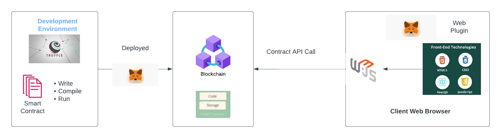
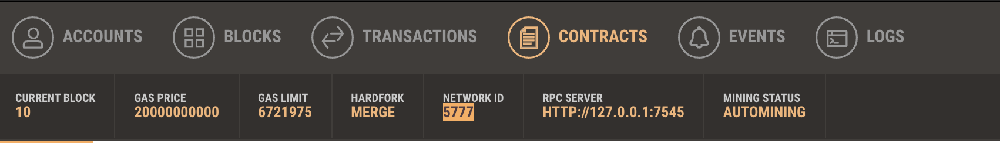
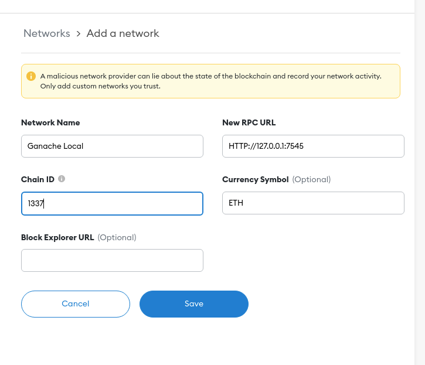
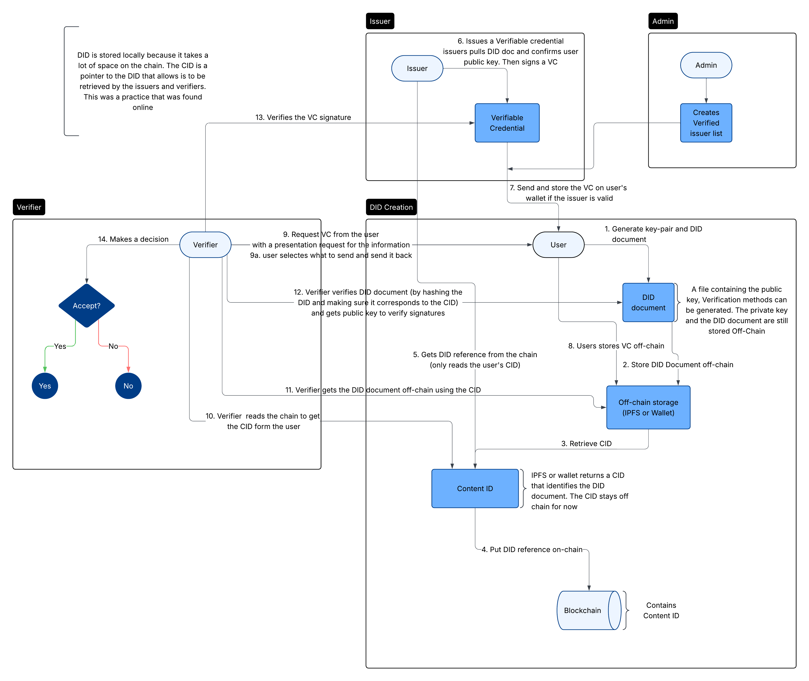

# DID-Blockchain-Project 

## Description
This project aims to implement Decentralized Identification (DID) using smart contracts. DID is a modern approach to identity management that removes
the need for centralized authorities, empowering users with greater privacy, security, and control over their personal information.

The DID Project provides a secure framework for:

- Storing decentralized identities on the blockchain

- Allowing institutions to issue verifiable credentials to DID holders

- Enhancing transparency and trust between users and credential issuers

This solution can be the foundation for secure and privacy-respecting decentralized identity 

## Architecture 
The architecture of this project was inspired from [this GitHub repo](https://github.com/Faizack/Supply-Chain-Blockchain?tab=readme-ov-file)
from Faizack about supply chain in blockchain. The smart contract is written in solidity (```.sol```) and it is compiled, migrated and after
deployed with Truffle.js on a Ganache blockchain test network. The front end is in Web3.js and communicates with the test network by connecting 
the wallets with Meta Mask wallet. Here is an image to illustrate the process that was also taken by the repository above : 


##  Basic File Structure 

Here the file structure is separated into different parts to help truffle development framework to compile the solidity files. 

- contracts : contains the ```.sol``` smart contracts and Migration.sol is a default contract for managing the contract migrations
- migrations : contains the JavaScript migration files that are used to deploy the smart contracts on the blockchain
- test : contains the tests for the different smart contracts 
- client : contains the client side code (usually HTML, CSS, and JS)
- images : contains the images for the README.md
- truffle-config.js : contains the configuration for the truffle project like the network configuration


```
DID-project/
├── contracts/
├── migrations/
├── test/
├── client/
│   ├── public/
│   ├── src/
│   └── package.json
├── images/
│
├── .env
├── .gitignore
├── truffle-config.js
└── README.md
```

## Setting up the Environment
### 1. Installation and Setup 
For this repository, the necessary installs are the following : 

- IDE of your choice
- Node.js : can be installed with the following link https://nodejs.org/
- Git : can be installed with the following link https://git-scm.com/downloads
- Ganache : can be installed with the following link https://www.trufflesuite.com/ganache
- MetaMask : a browser extension that can be installed on Chrome or Firefox

### 2. How to Create, Compile and Deploy the Contracts

- Clone the repository with git clone https://github.com/raph-abder/DID-project
- Install truffle by typing ```npm install -g truffle``` in the terminal 
- Install the dependencies by typing ```npm i``` in the terminal 
- Compile the smart contracts by typing in the terminal ```truffle compile```
- Deploy the smart contracts 
    - The deployment is done on the Ganache personal blockchain for Etherium development, that is typically used for Smart Contract deployment 
    - Open Ganache and create a new WorkSpace
    - Copy the RPC server address 
    
    - This server allows the communication between the contracts and the personal blockchain
    - Replace the RCP address in the ```truffle-config.js``` and replace the host address and the port with the one from Ganache
- After changing the configuration file, run the command ```truffle migrate``` in the terminal 
- The contract should be deployed on the personal blockchain and can be seen in the "contracts" table in Ganache 

### 3. Run the Client Side of the Application 
- After the deployment of the contracts, change directories to the client directory with ```cd client```
- Install all packages in the package.json file with ```npm i``` 
- Install Web3 package.json with ```npm install -save web3``
- Run the app ```npm start``` and the app should deploy on the local port 3000

### 4. Connect MetaMask with Ganache 
- Connect MetaMask in the browser and add a network to the extension 

- Name the network, add the RPC URL and the chain ID then click save
- Add an account from the Ganache network by copying the private key and adding it in Ganache


## Work Flow 



